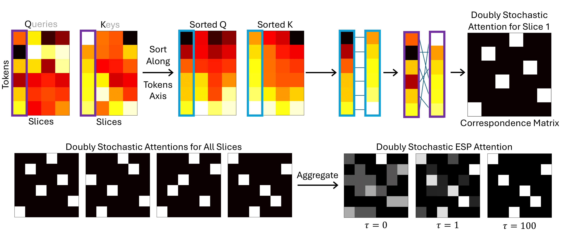

# ESPFormer: Doubly-Stochastic Attention with Expected Sliced Transport Plans

This repository contains the experiments and implementation code for **ESPFormer: Doubly-Stochastic Attention with Expected Sliced Transport Plans**.

<p align="center">
  
</p>

## Create/Activate Virtual Environment
   ```bash
   conda env create -f environment.yml
   conda activate esp
   ```
   
## Repository Structure
The repository is organized as follows:

- **`attentions/`**: Contains the various attention modules

- **`experiments/`**: 
   - **`catsdogs/`**: 

   - **`mnist/`**: 

   - **`model_net_40/`**: 
      - **`set_transformer/`**: 
      - **`point_cloud_transformer/`**: 
   
   - **`translation`**: 

   - **`sentiment/`**: 
      - Contains experiments for IMDB and TweetEval datasets.

- **`figures/`**: 
   
  
## Running the Experiments
   - Run each experiment from the root ESPFormer directory (to ensure proper access to the attention modules).
   - To switch between attention modules, specify the --attention_type flag as "esp", "dif", "vanilla", or "sink".

### MNIST
   Adjust patch size by modifying the patch_size list in **`experiments/mnist/one_expe_mnist.py`**.
   Specify the learning rate and inverse temperature hyperparameter using their respective command-line flags (--lr, --temperature).

   Run the experiment with the following command:
   ```bash
   python experiments/mnist/one_expe.py --attention_type <attention_type> --seed <seed>
   ```

### Cats and Dogs

1. **Download the Dataset**  
   Download the Cats and Dogs [dataset](https://www.kaggle.com/competitions/dogs-vs-cats/data).

2. **Rename and Place the Dataset Folder**  
   Rename the downloaded dataset folder to `examples` and place it inside the **`catsdogs/`** folder. 
   

3. **Run the Experiment**  
    Run the following command to run the experiment with a subset of the data:
    ```bash
    python experiments/catsdogs/one_expe.py --subset_perc <subset-percentage> --use_subset --attention_type <attention_type>
    ```
    To use the full training dataset, omit both the --subset_perc and --use_subset arguments:

    ```bash
    python experiments/catsdogs/one_expe.py --attention_type <attention_type>
    ```
    

### Sentiment Analysis - IMDB/TweetEval
   Relevant command-line arguments:
   - --dataset: "imdb" or "tweet_eval"
   - --max_seq_len: Use 512 for IMDB, 128 for TweetEval.
   
   Run the following command: 
   ```bash
   python experiments/sentiment/one_expe.py \
    --dataset <dataset> \
    --vocab_file wiki.vocab \
    --max_seq_len <max_seq_len> \
    --attention_type <attention_type> \
    --tokenizer sentencepiece \
    --pretrained_model wiki.model \
    --seed <seed>
   ```

## Acknowledgements
GitHub repositories:
- [DiffTransformer](https://github.com/microsoft/unilm/tree/master/Diff-Transformer)
- [Sinkformer](https://github.com/michaelsdr/sinkformers)
- [Sentiment Analysis](https://github.com/lyeoni/nlp-tutorial/tree/master/text-classification-transformer)
- [Translation](https://github.com/facebookresearch/fairseq/blob/main/examples/translation/README.md)
