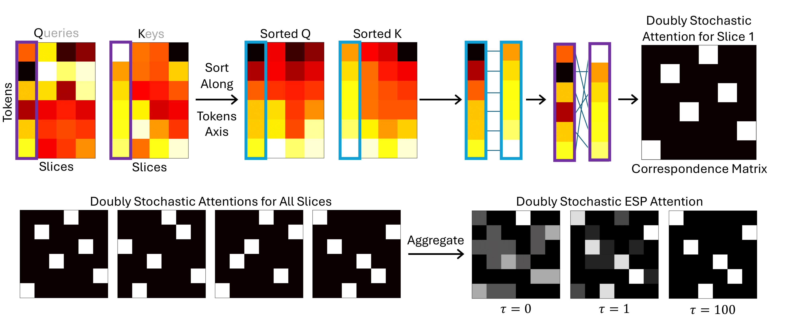

# ESPFormer: Doubly-Stochastic Attention with Expected Sliced Transport Plans

This repository contains our experiments and implementation code for **ESPFormer: Doubly-Stochastic Attention with Expected Sliced Transport Plans**.

<p align="center">
  
</p>

## Setup

1. **Clone the repository** (or download it) to your local machine.
2. **Create and activate a virtual environment** to isolate your project dependencies.

   ```bash
   python3.12 -m venv venv
   source venv/bin/activate #venv\Scripts\activate on Windows
   pip install -r requirements.txt
## Repository Structure

The repository is organized as follows:

- **`catsdogs/`**: Image classification experiment on cats and dogs  
  - **`examples/`**: Dataset folder
  - **`trainer_cats_and_dogs.py`**: Loads the `.npy` subset indices if the `use_subset` argument is set to `True` in `one_expe.py`.  
  - **`one_expe.py`**: Entry script to run a single experiment. You can specify the subset percentage and whether to use the subset.
  
  - To run the Cats & Dogs experiment with a subset of the data, use:
  ```bash
   python one_expe.py --subset_perc <subset-percentage> --use_subset